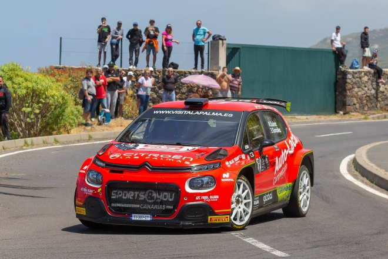
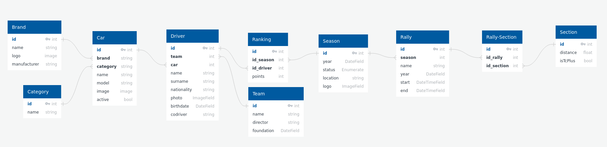

# Rally Canary Website 🇮🇨

A project for all [CCRA]('https://fcautomovilismo.com/') fans from the Canary Islands.

<div style='width:520px'>
    
</div>

_- Miguel Ángel Suárez - Eduardo González, champions of the canary asphalt rally championship in the season 2023_

The objetive is build a website where people can see information about Rallyes in the Canary Islands. The project will be developed with Django to continue learning this tool that I'm using in my studies
<br>
<br>

> [!NOTE]
> This project is for educational purposes only and there are likely to be errors in the code.

## Starting 🚀

_This section will help you to have a copy of the project in your local computer in case you want to work, change or test something_

The project is still **under development**, so there will be **no documentation on the deployment** of the project yet.

### Installation and requirements 🔧

_You can check requirements of the project on the [requirements.txt file](requirements.txt)_

Because the project will be done with Django-Python, we will need a Python Virtual Enviroment to install all dependencies. You can run in a terminal the following commands:

```console
$ python -m venv .venv --prompt mysite
$ source .venv/bin/activate
$ pip install -r requirements.txt
```

If something goes wrong make sure you have Python installed or or else try to launch the command indicating the version of Python:

```console
$ python3.X -m venv .venv --prompt mysite
```

> [!TIP]
> In case of doubts you can see [the documentation](https://docs.python.org/3/library/venv.html)

Some functionalities will involve the use of sensitive information, so we will use a `.env` file for this purpose. This file must be out of version control so you will need to create one. In the project (mostly in the settings.py file) there will be calls to a config function of the prettyconf library, all these calls are the information that the `.env` file must contain.

### Database 💾

The database that will be used in the project is PostgreSQL. This will help us to apply vectorial searches to allow user to search by various fields.

The current design is:

<div style='width:820px'>
    
</div>

_Database design was made with [QuickDB]('https://app.quickdatabasediagrams.com'). You can copy the code here below_

```Database
Brand
--
id int PK
name string
logo image
manufacturer string

Category
--
id int PK
name string

Car
--
id int PK
brand string FK >- Brand.id
category string FK >- Category.id
name string
model string
image image
active bool

#  Team
Team
--
id int PK
name string
director string
foundation DateField

Driver
--
id int PK
team int FK >- Team.id
car int FK >- Car.id
name string
surname string
nationality string
photo ImageField
birthdate DateField
codriver string

#  Rally
Season
--
id int PK
year DateField
status Enumerate
location string
logo ImageField

Ranking
--
id int PK
id_season int FK >- Season.id
id_driver int FK >- Driver.id
points int

Rally
--
id int PK
season int FK >- Season.id
name string
year DateField
start DateTimeField
end DateTimeField

Section
--
id int PK
distance float
isTcPlus bool

Rally-Section
--
id int PK
id_rally int FK >- Rally.id
id_section int FK >- Section.id
```

> [!IMPORTANT]
> Account funtionalities are going to be implemented but using Django auth methods. The only addition will be a Profile for the user.

## Contribution 🖇️

Feel free to contribute to the project in any way you want <3. I will be happy to receive help from experienced people to correct mistakes and learn, as I said the project will be a help to continue taking my first steps with Django. 😊

## License 📄

The project is under MIT License - you can see [LICENSE](LICENSE) for more details

---

⌨️ with ❤️ by Adrián ✌️
